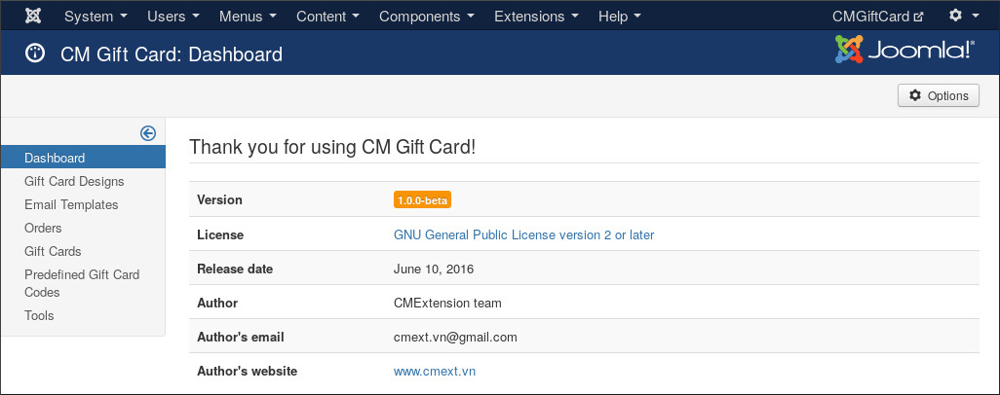
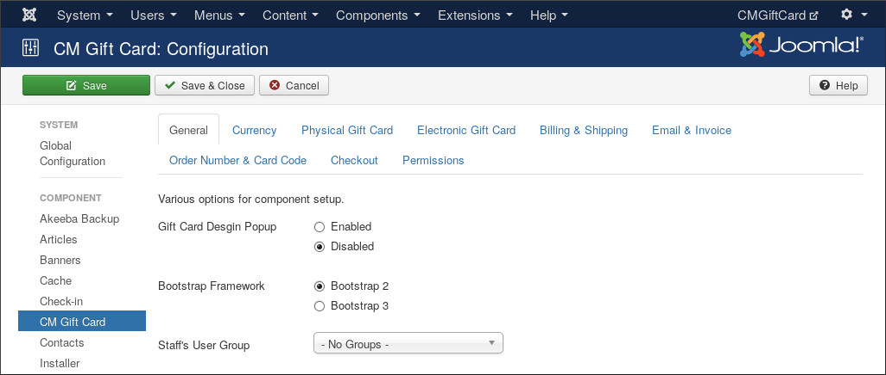
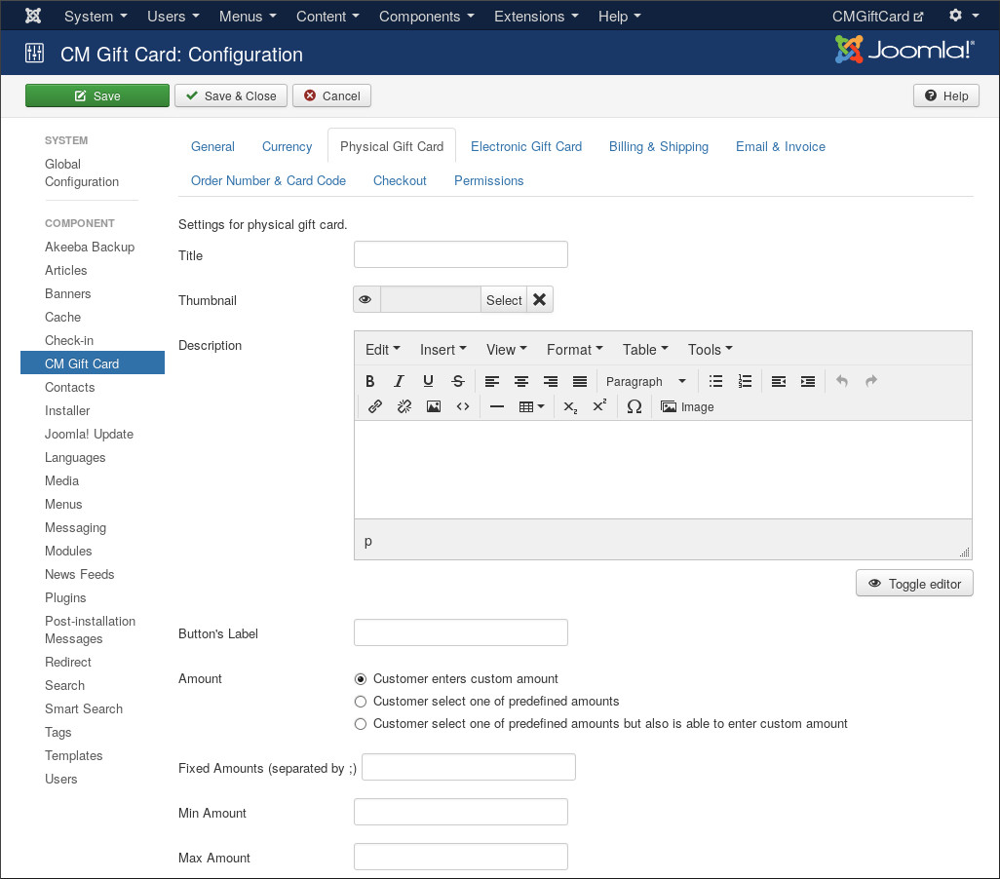
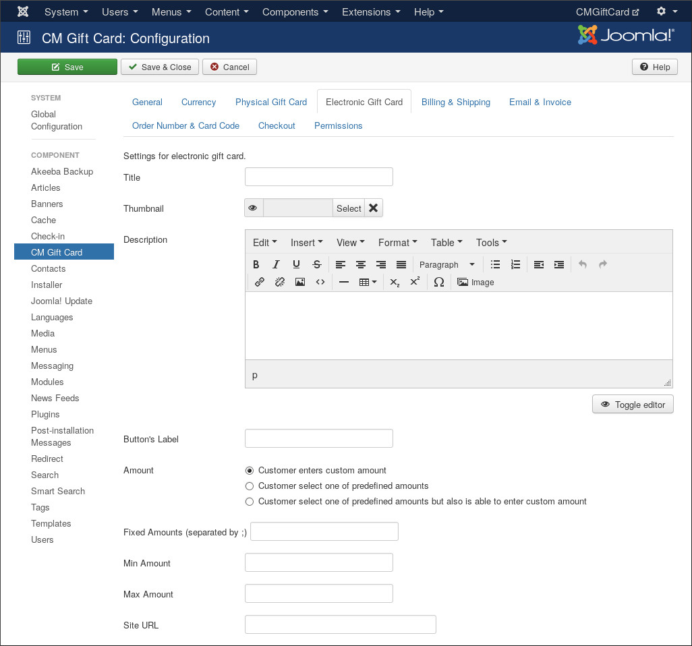
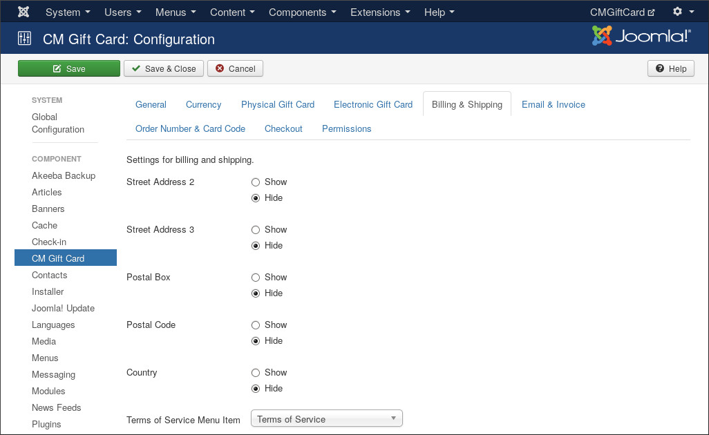
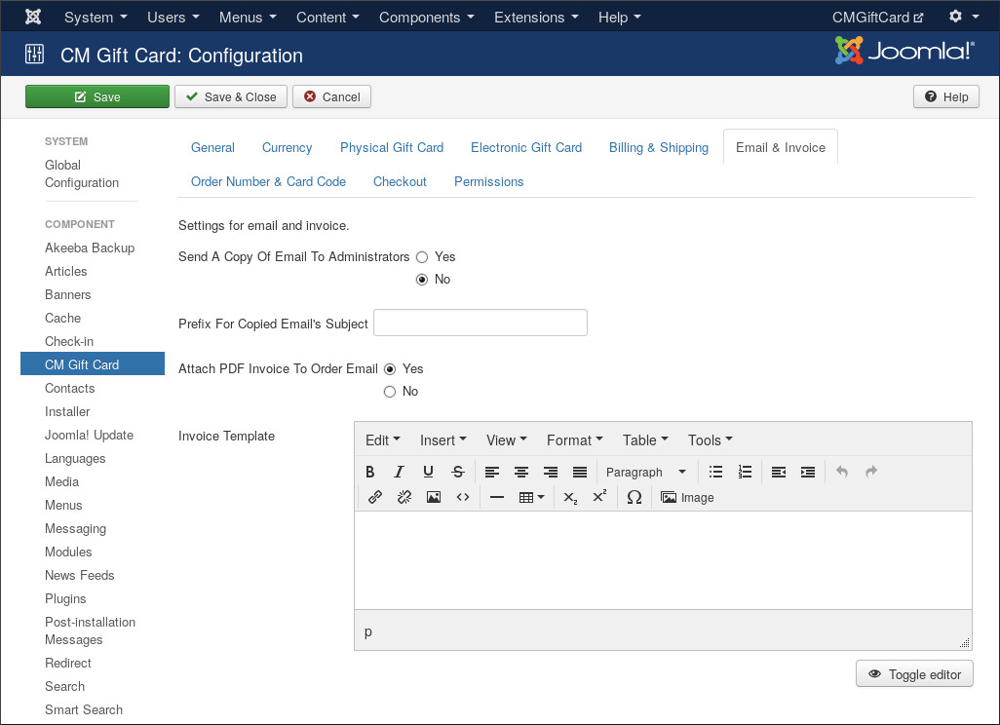
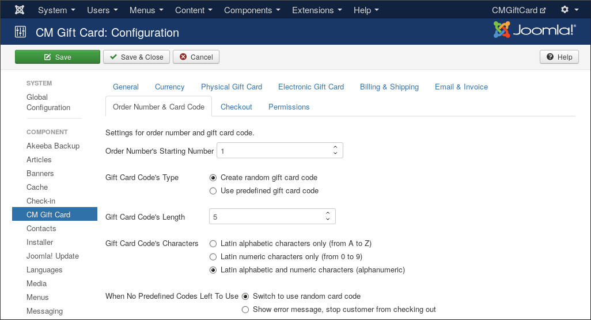
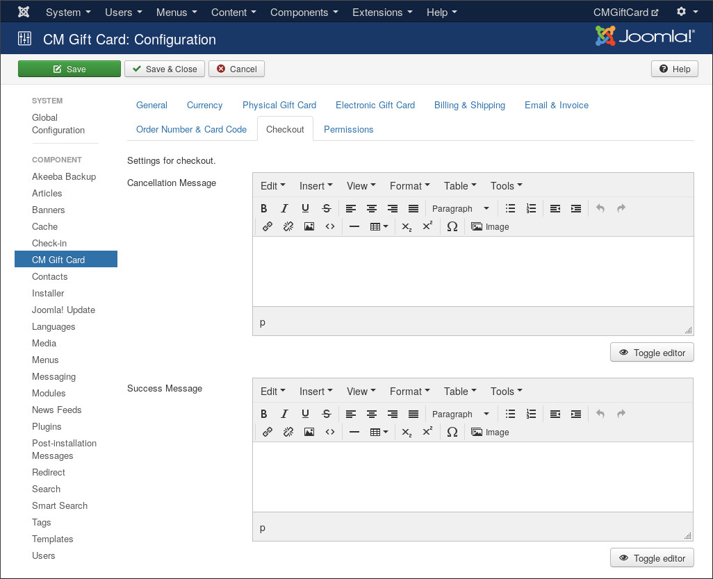
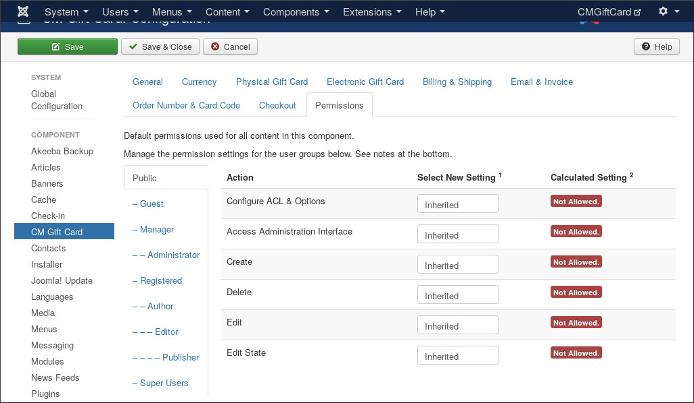

=============
Configuration
=============

After installing CM Gift Card, you can find it under "Components" menu item.

.. image:: ../images/configuration_01.jpg

The default of CM Gift Card is the dashboard. At the present time it only shows information of the installed release of CM Gift Card.

To configure CM Gift Card, you click the "Options" button on the top right of the page.

The configuration options are split into these following tabs:

* General
* Currency
* Physical Gift Card
* Electronic Gift Card
* Billing & Shipping
* Email & Invoice
* Order Number & Card Code
* Checkout
* Permissions

General
-------

* **Gift Card Design Popup**: If you enable this option, customer can view gift card design in a popup after clicking the gift card design's thumbnail.
* **Bootstrap Framework**: Select the Bootstrap framework version which is available in front-end. Bootstrap is often loaded by your current template, Joomla!, or third-party extensions.
* **Staff's User Group**: Select a Joomla! user group which your staff is in. Only the Joomla! users in the selected group have ability to check gift card's info in front-end.

Currency
--------

.. image:: ../images/configuration_04.jpg

* **Currency Symbol**: Enter your currency's symbol. For example "$" for U.S. Dollar.
* **Currency Symbol's Position**: Where the currency symbol is shown, before or after the amount.
* **Currency Decimals**: The number of decimals in currency.
* **Decimal Point**: Select the decimal point which is used for your currency, could be dot or comma.
* **Thousands Separator**: Show or hide thousands separator in your gift card's price.

Physical Gift Card
------------------

The following information are shown on the page where your customer choose between physical gift card and electronic gift card.

* **Title**: Enter the title which is used for physical gift card.
* **Thumbnail**: Select an image as a sample for physical gift card.
* **Description**: Introduction about your gift card.
* **Button's Label**: The label of the button which customer clicks to select and by physical gift card.

The following information are used and shown on the next page after physical gift card is selected to purchase.

* **Amount**: You can allow customer to enter a custom amount, or choose between a custom amount and your predefined amounts, or force customer to choose one of your predefined amounts.
* **Fixed Amounts**: Enter your predefined amounts, they are separated by a semicolon, for example: 10;20;30;40.
* **Min Amount**: The minimum amount which you allow to purchase.
* **Max Amount**: The maximum amount which you allow to purchase.

Electronic Gift Card
--------------------

The configuration options of electronic gift card are the same to physical gift card. There is one option which only electronic gift card has:

* **Site URL**: Electronic gift cards can be sent via cron job, because cron job runs a PHP script in command line environment so it can't get your site's URL, you need to enter your site's URL to let CM Gift Card's cron job script knows your site's URL and inserts it in emails sent to gift card recipients.

Billing & Shipping
------------------

You can configure to show the address's parts which you don't use in shipping and billing info: street address line 2 and 3, postal box and code, or city.

With "Terms of Service Menu Item", you select a menu item which shows your Terms of Service. This menu item is shown a link in Terms of Service agreement section in checkout page.

Email & Invoice
---------------

* **Send A Copy Of Email To Administrators**: If you enable this option, administrators will receive a copy of customer's order email which is sent to customer after purchase is completed.
* **Prefix For Copied Email's Subject**: If you send a copy of customer's order email to administrators, you can use this option to add a special prefix to email subject. This give you ability to filter these emails easly in your inbox.
* **Attach PDF Invoice To Order Email**: Attach PDF invoice for customer's order in the email sent to him/her.
* **Invoice Template**: You design your invoice template by using HTML and CSS. You can check :ref:`ref-invoice-template` section for more info and sample template.

Order Number & Card Code
------------------------

* **Order Number's Starting Number**: Instead of starting from 1, the first order number on your site can be a custom number. For example, if you enter 2507 then the first order on your site will have order number 2507, the next one is 2508, 2509 and so on.
* **Gift Card Code's Type**: You can use your own codes as gift card codes or let CM Gift Card generates unique and random codes.
* **Gift Card Code's Length**: The maximum character quantity of gift card code. This affects both predefined code and random code.
* **Gift Card Code's Characters**: The types of characters allowed in gift card code. This affects both predefined code and random code.
* **When No Predefined Codes Left To Use**: If you use predefined code and all of your predefined codes are used already, we can switch to use random code or show an error and not allow customer to checkout.

Checkout
--------

* **Cancellation Message**: The message which is shown to customer after he cancels the payment and is taken back to your site.
* **Success Message**: The message which is shown to customer after he completes the payment and is taken back to your site.

Permissions
-----------

These permission options are only used if you allow the users who are not administrators to access your back-end. You can use these options to allow them to or to forbid them in using some specific functions of CM Gift Card in back-end.