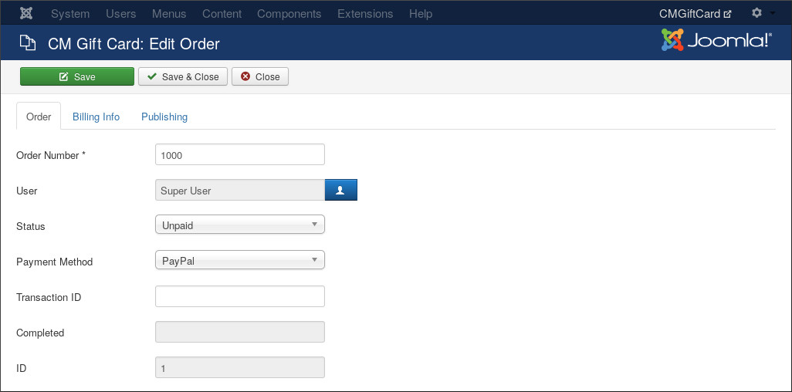
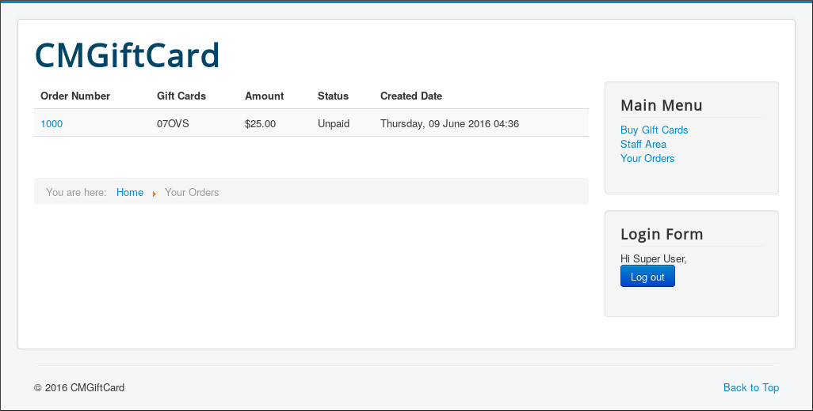

=============
Manage Orders
=============

In Back-End As Administrator
----------------------------

To access order list, from the top menu you navigate to Components -> CM Gift Card -> Orders.

.. image:: ../images/order_backend_01.jpg

Edit an order, in "Order" tab you can edit its order name, owner, status, payment method and transaction ID (if transaction is already completed).

The "Billing Info" tab has fields to edit billing information.

.. image:: ../images/order_backend_03.jpg

"Publishing" tab has info for created date and the last modification.

In Front-End As Customer
------------------------

You select the menu where you want to create menu item for customer's order list, click the "New" button on the toolbar to create a new menu item.

.. image:: ../images/default_01.jpg

Select "Orders" in the next popup.

.. image:: ../images/menu_item_types.jpg

Give your menu item a title and configure other options if you need then save the menu item.

Access the menu item you have just created as a logged-in user to see your orders.

You click order number to view order's detail including the gift cards of the order.

.. image:: ../images/order_frontend_03.jpg